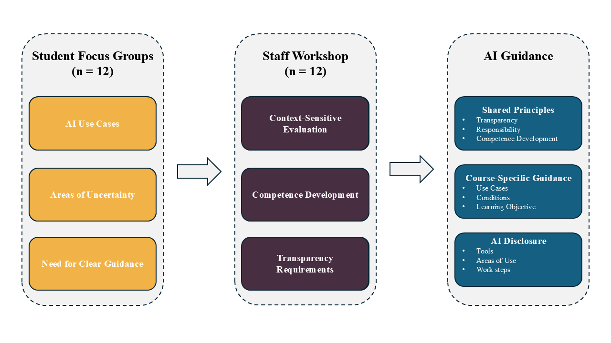
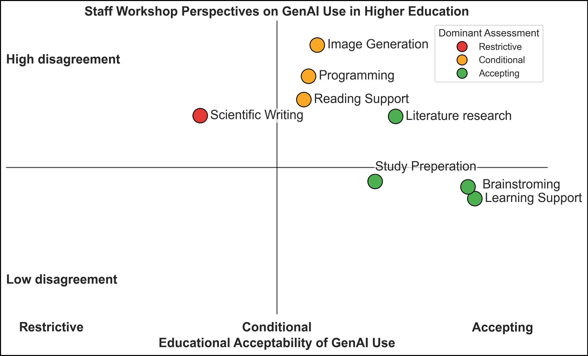

# "It depends on the course”: Co-Designing Context-Sensitive Guidelines for GenerativeAI Use in Informatics Education

<hr>

**First Author¹* · Second Author¹ · Third Author¹*

¹Group, City, Country  

*✉ Correspondence to: [mail](mailto:mail)*  
`{mail}@mail`
</div>

<hr>

## Abstract

The adoption of generative artificial intelligence (GenAI) in higher education has created a practical governance problem: students increasingly use AI tools across academic activities, while instructors must decide which forms of use support learning and which undermine the competencies that courses are intended to develop. 
Although many universities have published GenAI guidelines, translating general principles into context-sensitive guidance remains challenging. Existing work provides limited insight into how students and teaching staff can be systematically involved in developing guidance that reflects both educational objectives and actual AI use practices. This challenge extends beyond individual institutions, creating a need for transferable processes that support local AI governance.
This paper reports a case study of developing GenAI guidance within a university Media Informatics program. The process combined two student focus groups (n=12) with a workshop involving teaching staff (n=12) across hierarchical levels. Student discussions informed a set of recurring GenAI use cases that were subsequently evaluated and discussed by instructors. The findings reveal substantial differences in perceived acceptability and considerable disagreement among instructors. Rather than producing a uniform catalogue of permitted and prohibited practices, the process resulted in a layered approach combining shared principles, course-specific decisions, and standardized disclosure of AI use. Based on these findings, we implemented a configurable guidance infrastructure for instructors and students. The study contributes both a transferable governance process and an empirical account of its application within a Media Informatics context, arguing that acceptable AI use should be considered in relation to the competencies and learning processes that educational activities are intended to develop.

*Keywords: generative AI; higher education; informatics education; AI governance; academic integrity; participatory design; AI literacy*

## Results

Overview of the participatory process.


Staff workshop positioning map.


## Repository structure

```text
.
├── LICENSE
├── README.md
├── 01_students_focus_groups/
├── 02_staff_workshop/
├── 03_code/
├── 04_images/
├── 05_misc/
└── ...
```

This repository contains the project documentation, workshop materials, analysis scripts, and generated figures used for the study.

## Citation

TBA

